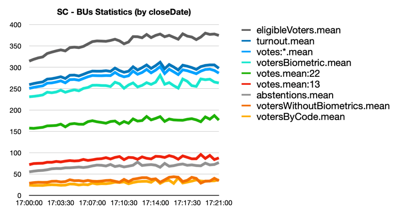

# São Paulo (SP) - BU Analysis

**Brazilian Election - 2022/10/02**

--------------------------------------------------------

This is a statistical analysis of the BU files
of the state of São Paulo (SP).

- `BU` stands for "Boletin de Urna" (Ballot Box).

All analyzes are based on **public available data** of the Voting Machines
of the election in Brazil from the TSE website: http://resultados.tse.jus.br

- TSE stands for: "Tribunal Superior Eleitoral" ("Superior Electoral Court").

For the state of São Paulo (SP) `101071` BU files were analyzed (99.9% of all the available BU files).

- NOTE: The state of São Paulo represents 27 million of votes
  from the 123 million of votes in Brazil

## SP Results:

- Office election: `presidente`
- Abstentions Ratio: `0.2161`
- Total votes: `25655938` (valid votes: ignoring `blank` and `null` votes)
- BUs: `101071`


- Candidate: `22`
    - Votes: `12239783` (`47.71%`)
    - BUs: `101067` (with votes for this candidate).
    - Average votes by BU: 121.11


- Candidate: `13`
  - Votes: `10489884` (`40.89%`)
  - BUs: `101071` (with votes for this candidate).
  - Average votes by BU: 103.79


## Metrics

The analyzed metrics are:


- `closeDate`:
    - BUs ordered by `close` date.
        - The date of the LAST vote int the Voting Machine.
    - Checks if the `closeDate` (last vote) of a Voting Machine influences the voting ratio for a candidate.
- `generationDate`:
    - BUs ordered by `generation` date.
        - The date that the original BU file was generated.
    - Checks if the `generationDate` of a Voting Machine influences the voting ratio for a candidate.
- `emissionDate`:
    - BUs ordered by `emission` date.
        - The date that the original BU file was emitted.
    - Checks if the `emissionDate` of a Voting Machine influences the voting ratio for a candidate.
- `loadDate`:
    - BUs ordered by `load` date.
        - The date that the Voting Machine system was loaded/installed.
    - Checks if the loaded/installed system at some date influences the voting ratio for a candidate.
- `votersReleasedByCodeRatio`:
    - BUs ordered by `votersReleasedByCodeRatio`.
        - The ratio of votes released by code (without biometric input: finger scan).
    - Checks if Voting Machines with less or more votes without biometric input have some anomaly/tendency for a candidate.
- `onlyPresidentVotesRatio`:
    - BUs ordered by `onlyPresidentOfficeVotesRatio`.
        - The ratio of votes only for president (without vote for governor) in the same election day.
        - It can have a ratio > then 1.0, since it's possible to have votes for governor and not for president too.
    - Checks if Voting Machines with more votes only for president have some anomaly/tendency for a candidate.

## Exported Statistics

You can find a CSV file for each analyzed metric:

  - `./bu-statistics--sp--$METRIC.csv`: 

## SP - `closeDate` (main anomaly)

The main statistical *"anomaly"* can be found in the `closeDate` metric for president. 

The `closeDate` is the date and time the Voting Machine closes on election day.
This is defined by the time of the **LAST** vote in the voting machine
(*also the LAST vote to influence the BU file*).

The formal definition at file `bu.asn1` is:

- (ENG) `closeDate`: Date and time of end of vote acquisition (last vote) in the format adopted by the Electoral Court (YYYYMMDDThhmmss).
- (PT) `closeDate`: dataHoraEncerramento: Data e hora do término da aquisição do voto (Último voto) no formato adotado pela Justiça Eleitoral (YYYYMMDDThhmmss).

The real world process to "close" the Voting Machine depends on a closing operation
started manually by the operator of the Voting Machine, that should happen soon after
the last vote.

If everything happens normally in a voting section the voting machine is closed at `17:00`,
and the last vote must take place near this time.

In the state of São Paulo `101071` BU files (one for each Voting Machine) where analyzed,
totaling `25655938` votes for president.

In this metric we sort the BUs by `closeDate`. From `17:00` to `17:10` the closed BUs will have
`72.43%` of all votes in the state, with `18583664` votes in `75756` BUs.

After sort the BUs by `closeDate` we separate them in blocks of 30s, then we
calculate the voting statistics of the 30s block (non-cumulative).

- `17:00:00 - (Candidate 22: 545029 votes 53.19%) ; (Candidate 13: 369012 votes 36.02%) ; (total votes: 1024592 3.99% ; abstentions: 22.41%)`
- ...
- `17:05:00 - (Candidate 22: 378934 votes 47.42%) ; (Candidate 13: 325173 votes 40.69%) ; (total votes: 14205687 55.37% ;  abstentions: 21.64%)`
- ...
- `17:10:00 - (Candidate 22: 114929 votes 43.47%) ; (Candidate 13: 117562 votes 44.47%) ; (total votes: 18583664 72.43% ;  abstentions: 21.38%)`

It's very easy to see that the voting percentage for candidate `13` went from `36%` to `44%`
in 10min (with 18583664 of total votes and 72% of all available votes). For the candidate
`22` it went from `53%` to `43%`.

**The main issue is that the `closeDate` is not the calculation time by the TSE computer,
but the actual time of the last vote and closing operation in each Voting Machine.
This is *IMPOSSIBLE* to happen in a real world, because a VERY HIGH percentage of
BUs will need to be coordinated to have the close operation in the Voting Machine to happen
in the exact same distribution of the results in the Voting Machine for candidate 13
(from `36%` to `44%`). It would be necessary to know a priori the result of each Voting
Machine to include the last vote in the correct order of Voting Machines.**

**Since we are talking about an event of only 10min, `75756` BUs and `18583664` of votes *(one vote per person in the day)*,
it's *IMPOSSIBLE* to have this behavior in the real world without break the integrity of the Voting Machines
and  without have the active participation of thousand of people to generate this `closeDate` behavior.**

Here's the first 10min of the CSV file for the `closeDate` metric:

`bu-statistics--sp--closeDate.csv`:

| closeDate | ratio:22 | ratio:13 | votes:22 | votes:13 | votes:* |  bus | turnout  | abstentions | absten.Ratio | votersW/oBiom.mean | total    | totalRatio |
|-----------|----------|----------|----------|----------|---------|------|----------|-------------|--------------|--------------------|----------|------------|
| 17:00:00  | 0.5319   | 0.3602   | 545029   | 369012   | 1024592 | 4403 | 1081960  | 312508      | 0.2241       | 37.6893            | 1024592  | 0.0399     |
| 17:00:30  | 0.5331   | 0.3607   | 935715   | 633197   | 1755296 | 7509 | 1853732  | 533225      | 0.2234       | 37.7829            | 2779888  | 0.1084     |
| 17:01:00  | 0.5277   | 0.3645   | 978305   | 675654   | 1853807 | 7796 | 1958942  | 556199      | 0.2211       | 39.0747            | 4633695  | 0.1806     |
| 17:01:30  | 0.5205   | 0.3694   | 875198   | 621159   | 1681477 | 7015 | 1776777  | 500792      | 0.2199       | 40.8778            | 6315172  | 0.2461     |
| 17:02:00  | 0.5124   | 0.3760   | 801159   | 587892   | 1563479 | 6455 | 1652913  | 464824      | 0.2195       | 44.2830            | 7878651  | 0.3071     |
| 17:02:30  | 0.5046   | 0.3823   | 687946   | 521232   | 1363313 | 5589 | 1442363  | 402836      | 0.2183       | 45.4366            | 9241964  | 0.3602     |
| 17:03:00  | 0.4993   | 0.3870   | 617503   | 478658   | 1236732 | 5048 | 1308617  | 363639      | 0.2175       | 45.9509            | 10478696 | 0.4084     |
| 17:03:30  | 0.4934   | 0.3912   | 537492   | 426138   | 1089377 | 4395 | 1153053  | 315410      | 0.2148       | 48.2858            | 11568073 | 0.4509     |
| 17:04:00  | 0.4882   | 0.3955   | 467084   | 378421   | 956838  | 3861 | 1014121  | 278180      | 0.2153       | 48.9218            | 12524911 | 0.4882     |
| 17:04:30  | 0.4791   | 0.4033   | 422384   | 355564   | 881624  | 3526 | 934212   | 256274      | 0.2153       | 51.7147            | 13406535 | 0.5226     |
| 17:05:00  | 0.4742   | 0.4069   | 378934   | 325173   | 799152  | 3181 | 847335   | 233998      | 0.2164       | 51.6784            | 14205687 | 0.5537     |
| 17:05:30  | 0.4645   | 0.4165   | 318909   | 285990   | 686615  | 2736 | 727772   | 200512      | 0.2160       | 52.3154            | 14892302 | 0.5805     |
| 17:06:00  | 0.4654   | 0.4174   | 279008   | 250226   | 599499  | 2362 | 636380   | 174808      | 0.2155       | 54.5059            | 15491801 | 0.6038     |
| 17:06:30  | 0.4553   | 0.4265   | 239231   | 224091   | 525386  | 2052 | 557622   | 150824      | 0.2129       | 55.2729            | 16017187 | 0.6243     |
| 17:07:00  | 0.4589   | 0.4211   | 226740   | 208061   | 494048  | 1920 | 524576   | 142979      | 0.2142       | 56.5354            | 16511235 | 0.6436     |
| 17:07:30  | 0.4502   | 0.4299   | 196948   | 188068   | 437509  | 1692 | 464587   | 126995      | 0.2147       | 57.2606            | 16948744 | 0.6606     |
| 17:08:00  | 0.4470   | 0.4324   | 177433   | 171646   | 396935  | 1522 | 421668   | 113090      | 0.2115       | 58.6104            | 17345679 | 0.6761     |
| 17:08:30  | 0.4469   | 0.4317   | 157426   | 152061   | 352276  | 1344 | 374234   | 102765      | 0.2154       | 59.7329            | 17697955 | 0.6898     |
| 17:09:00  | 0.4391   | 0.4394   | 141773   | 141868   | 322882  | 1231 | 343516   | 93084       | 0.2132       | 58.5491            | 18020837 | 0.7024     |
| 17:09:30  | 0.4393   | 0.4391   | 131108   | 131057   | 298462  | 1126 | 317010   | 85285       | 0.2120       | 58.9547            | 18319299 | 0.7140     |
| 17:10:00  | 0.4347   | 0.4447   | 114929   | 117562   | 264365  | 993  | 280689   | 76326       | 0.2138       | 58.0916            | 18583664 | 0.7243     |

- *The CSV is generated until 84% of all votes, since after
  that each `closeDate` block of 30s is too small in BUs for statistical
  analysis.*
- `absten.Ratio`and `votersW/oBiom.mean` column names were "abbreviated" to reduce the table width in PDF.
- See `bu-statistics--sp--closeDate.csv` for extra columns.
- See `bu-statistics--sp--closeDate--commadec.csv` if you need comma (`,`) as decimal delimiter. 

CSV Columns:

- `closeDate`: The time of BUs block (by `closeDate` and 30s window).
- `ratio:22`: Votes ratio for candidate `22` (non-cumulative).
- `ratio:13`: Votes ratio for candidate `13` (non-cumulative).
- `votes:22`: Votes for candidate `22` (non-cumulative).
- `votes:13`: Votes for candidate `13` (non-cumulative).
- `votes:*`: Votes for all candidates (non-cumulative).
- `bus`: Number of BU files in the block.
- `turnout`: The total number of people voting.
- `abstentions`: The number of abstentions (people who did not attend the election).
- `abstentionsRatio`: The ratio of abstentions.
- `votersWithoutBiometrics`: Number of votes without biometric identification.
- `total`: Total number of votes (cumulative).
- `totalRatio`: Ratio of `total` votes (cumulative).

## SP - BUs Chart

You can see in the image below a chart with the data in
the `bu-statistics--sp--closeDate.csv` file. 


### Comparing with SC

If compared with the state of Santa Catarina (SC)
the anomaly in SP is clearly visible:



What the comparison showed:

- **In SP the number of `votersWithoutBiometrics` is much higher.**
- **The `abstentions` in SP is a straight line (not following the proportion of eligibleVoters in th BUs).**

### Chart Series:

- `eligibleVoters.mean`: The total number of eligible voters in the BU (average by BU).
- `turnout.mean`: The total number of people voting (average by BU).
- `votes:*.mean`: The average of total valid votes per BU.
- `votersBiometric.mean`: Number of votes with biometric identification (average by BU).
- `votes.mean:22`: The average of voters per BU for candidate `22`.
- `votes.mean:13`: The average of voters per BU for candidate `13`.
- `abstentions.mean`: The number of abstentions (average by BU).
- `votersWithoutBiometrics.mean`: Number of votes without biometric identification (average by BU).
- `votersByCode.mean`: Number of votes with failed biometric identification, and released by code (average by BU).
- `closeDate`: The time of BUs block (by `closeDate` and 30s window) (Axis X).

## LICENSE

MIT License

## Authors

The authors of this analysis worked hard to give a fully reproducible work,
what legitimates the data and the analysis of this Election data.

This work was verified by people at different major universities in
Brazil, USA and Switzerland.

If necessary this address will be used to guarantee the authorship of the work:

```text
1Gh5Qtc7UpLt31Ma85HwZLduGwPFHFS2AH
```
